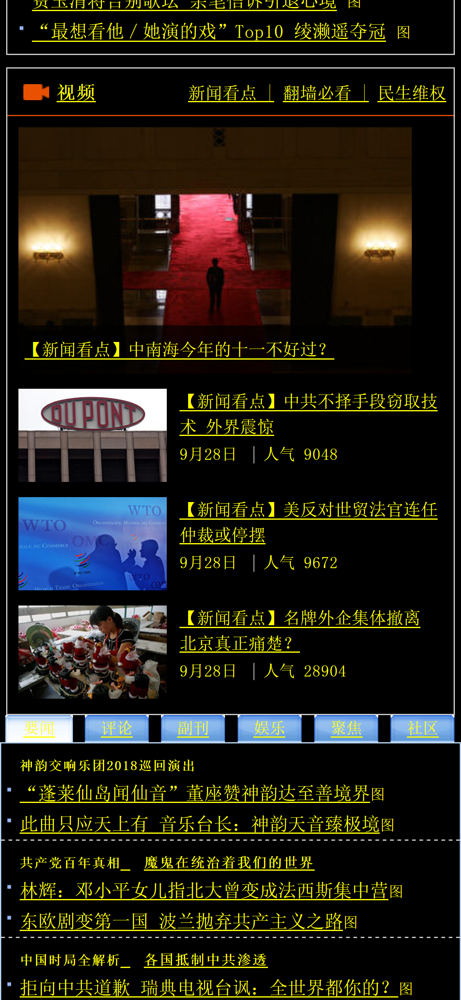

# high-contrast-epoch-times

Makes the Chinese mobile Epoch Times website better for accessibility.

A Chrome extension to tweak my grandfather's favorite website.
Intended to be used with the mobile version of the site.

Epoch Times' website uses pixel font sizes, and as a result the font sizes
cannot be overridden by the user. Browsers let users change the default font
sizes so that users like my grandfather can read text that would normally be
too small to see. Websites use `em` units for text rather than `px` to obey
these settings and show text relative to the chosen size.

The extension automatically converts pixel `font-size` and `line-height` values
to use `em` units instead. It also uses high contrast text colors (black
background and yellow text) to make it easier to read.

## Before and After

